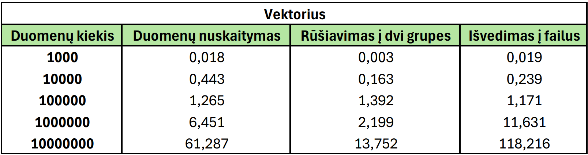

# OOP
## Aprašymas
- v0.1 pradinėje versijoje sukuriama Studentas struktūra studento duomenims saugoti. Vartotojui leidžiama pasirinkti galutinio balo skaičiavimo būdą. Aprašomos dvi funkcijos apskaičiuoti galutinį balą naudojant vidurkį arba medianą. Sukuriamos funkcijos įvesti studento vardą, pavardę ir namų darbų ir egzamino pažymius, leidžiama vartotojui pasirinkti įvesti pažymius patiems arba juos generuoti atsitiktinai. Pasirinkimai ir įvesti duomenys yra išvedami.
- v0.1 pradinė versija papildoma nuskaitymu iš failo. Vartotojas pasirenka ar nori įvesti duomenis ranka, ar nuskaityti iš failo ir ar nori išvedimą matyti ekrane ar sukurti ir įrašyti į naują failą. Projektas apiforminamas, surūšiuojami studentai, panaudojamas išimčių valdymas.
- v0.2 versijoje programa papildoma failų generavimu ir nuskaitytų failų suskirstymu į dvi grupes pagal galutinį pažymį. Šios grupės įrašomos į atskirus failus, surūšiuotus pagal naudotojo parinktą parametrą. Atlikta programos veikimo greičio analizė.
- v0.3 versijoje pridedama galimybė pasirinkti dirbti su vektoriais arba su sąrašais.

## Programos veikimo greičio analizė
Programos testavimas su studentų sąrašų failais, sudarytais iš `1000`, `10000`, `100000`, `1000000`, `10000000` įrašų buvo pakartotas 3 kartus, atskirai dirbant su vektoriais ir sąrašais. Pateikiami šių testų laikų vidurkiai.

### Failų kūrimas
| Kiekis | Laikas |
|:-------|-------:|
| `1 000` | 0,009s |
| `10 000` | 0,045s |
| `100 000` | 0,390s |
| `1 000 000` | 3,943s |
| `10 000 000` | 34,656s |

## Testavimas

## Analizė
Kai duomenų kiekis mažesnis, programos greitis naudojant vektorius ir sąrašus mažai skiriasi. Tačiau dirbant su 10 000 000 įrašų skirtumas tampa akivaizdesnis – su vektoriais programa veikia žymiai greičiau.

## Testavimo sistemos parametrai
- CPU: Intel(R) Core(TM) i5-8265U CPU @ 1.60GHz, 1800 Mhz, 4 Core(s), 8 Logical Processor(s)
- RAM: 8.00 GB
- HDD: WDC WD10SPZX-21Z10T0
- SSD: NVMe KINGSTON RBUSNS8154P3128GJ1